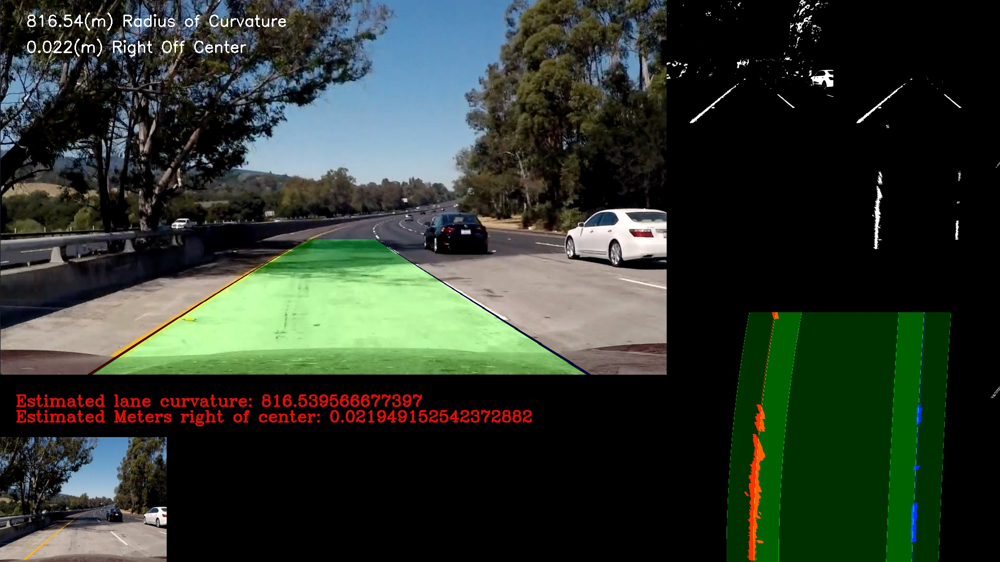

***Advance Lane Finding***

This is a project of finding lanes. It uses computer vision techniques to process video frames,
estimate and construct the lanes. The techniques may bu used for self-driving-car to recognize the 
boundary of road lane. 

For details, please read the [writeup](./writeup.md)

Here is the video clip produced by the project: 
[processed project\_video.mp4](https://www.youtube.com/watch?v=YI1ntss2qcY)
