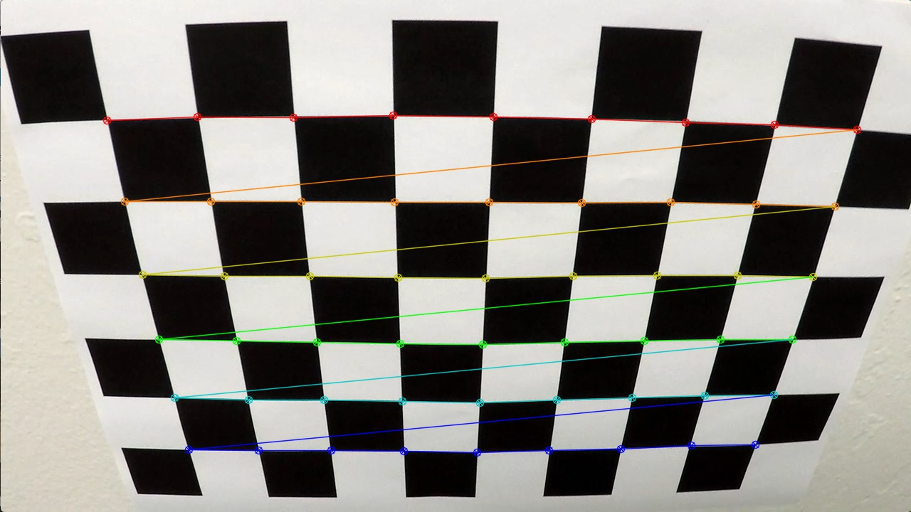
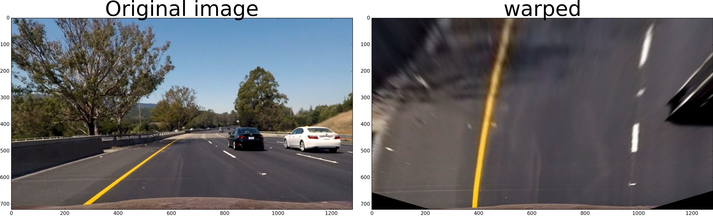

****Advanced Lane Finding Project****

# The goals / steps of this project are the following:

-   Compute the camera calibration matrix and distortion coefficients given a set of chessboard images.
-   Apply a distortion correction to raw images.
-   Use color transforms, gradients, etc., to create a thresholded binary image.
-   Apply a perspective transform to rectify binary image ("birds-eye view").
-   Detect lane pixels and fit to find the lane boundary.
-   Determine the curvature of the lane and vehicle position with respect to center.
-   Warp the detected lane boundaries back onto the original image.
-   Output visual display of the lane boundaries and numerical estimation of lane curvature and vehicle position.

# [Rubric](<https://review.udacity.com/#!/rubrics/571/view>) Points

Here I will consider the rubric points individually and describe how I addressed each point in my implementation.  

## Camera Calibration

### 1. Briefly state how you computed the camera matrix and distortion coefficients. Provide an example of a distortion corrected calibration image.

Using Open CV's calibrateCamera, the camera matrix and distortion coefficients are calculated in program [ calibrate.py](calibrate.py).

Below is the code segment for calibration. 

`calibration`:

    # The number of inside corners horizontal, and vertical respectively
    nx, ny = 9, 6
    
    object_model = np.zeros((nx*ny, 3), np.float32)
    # coordinates of corners, (row, column, 0), there are nx*ny of such tuples.
    object_model[:,:2] = [[i, j] for j in range(ny) for i in range(nx)]
    # The above is equivalent to the following:
    # object_model[:, :2] = np.mgrid[0:nx, 0:ny].T.reshape(-1, 2)
    # I don't understand the expression.
    
    # Store the object points and images points
    obj_points = []                 # for multiple object model compared to the image corner points
    img_points = []                 # for multiple image corner points
    
    # Get the list of images for calibration
    images = glob.glob("./camera_cal/calibration*.jpg")
    
    # process images for image corner points
    for fname in images:
        img = cv2.imread(fname)
        gray = cv2.cvtColor(img, cv2.COLOR_BGR2GRAY)
    
        # find the corners on the chessboard
        ret, corners = cv2.findChessboardCorners(gray, (nx, ny), None)
    
        if ret == True:
            print("Working on ", fname)
            obj_points.append(object_model)
            img_points.append(corners)
    
            cv2.drawChessboardCorners(img, (nx, ny), corners, ret)
            saved_name = './output_images/' + 'corners_found_' + os.path.basename(fname)
            cv2.imwrite(saved_name, img)
        # End of if ret == True
    # End of for idx, fname
    
    img = cv2.imread("./camera_cal/calibration2.jpg")
    height, width = img.shape[:2] # the first two dimensions are the height, and width of the image
    
    # perform calibration
    ret, mtx, dist, rvecs, tvecs = cv2.calibrateCamera(obj_points, img_points, (width, height), None, None)

I started by preparing "object\_model", which will be the (x, y, z) coordinates of the chessboard corners in the 3-D real world. 
Here I am assuming the chessboard is fixed on the (x, y) plane at z=0, such that the object points are the same for each calibration image.  
\`obj\_points\` will be appended with a copy of object\_model, every time I successfully detect all chessboard corners in a test image.  
\`img\_points\` will be appended with the (x, y) pixel position of each of the corners in the image plane with successful chessboard detections.  

I then used the output \`obj\_points\` and \`img\_points\` to compute the camera calibration and distortion coefficients using the \`cv2.calibrateCamera()\` function.  

Here is a sample image showing correct inside corners being found.

I applied this distortion correction to the test image using the \`cv2.undistort()\` function and obtained this result: 

The correction looks effective. 

1.  How to produce the pickle file ./calibration\_pickle.p

    ==:
    
        python ./calibrate.py
    
    This file will be used in undistorting video frames, and images. 

## Pipeline (single images)

### 1. Provide an example of a distortion-corrected image.

Below is the code segment of how I apply cv2.undistort with calibration data:

`calibrate-test-image`:

    import numpy as np
    import cv2
    import pickle
    import glob
    #from tracker import tracker
    
    import os.path
    
    import utils
    
    def undistort_test():
        calibration_pickle = pickle.load(open("./calibration_pickle.p", "rb"))
        mtx = calibration_pickle["mtx"]
        dist = calibration_pickle["dist"]
    
        img_paths = glob.glob('./test_images/test*.jpg')
    
        for fname in img_paths:
            img = cv2.imread(fname)
            undistorted = cv2.undistort(img, mtx, dist, None, mtx)
    
            saved_name = './test_images/' + 'undistorted_' + os.path.basename(fname)
            cv2.imwrite(saved_name, undistorted)
        # End of for fname
        img = cv2.cvtColor(img, cv2.COLOR_BGR2RGB)  # cv2.imread in BGR
        undistorted = cv2.cvtColor(undistorted, cv2.COLOR_BGR2RGB)
        utils.display_side_by_side(img, undistorted, caption="Undistorted_test",
                             save_path="./output_images")
    
    def main():
        undistort_test()
        return 0

Here is a sample of the undistorted with test image:

### 2. Describe how (and identify where in your code) you used color transforms, gradients or other methods to create a thresholded binary image. Provide an example of a binary image result.

After much experiment, I settled down to use color tracking of Open CV:
<http://docs.opencv.org/3.2.0/df/d9d/tutorial_py_colorspaces.html>

Compared with thresholding with trial and error in HSV, or HLS, with the color space of HSV, I can specify the color range for the white and yellow colors, to just mask for the pixels satisfying with 
the specified range. It turned out to be the most reliable tracking the lane lines. 

The following is the code for the binary data extraction: (the full code is at [pipeline.py](./pipeline.py))

`binary_for_lanes`:

    import utils
    import cv2
    import matplotlib.image as mpimg
    import numpy as np
    
    def binary_for_lanes(image, fname=None, debug=False):
        import numpy as np
        hsv_image = cv2.cvtColor(image, cv2.COLOR_RGB2HSV)
        binary_mask = get_lane_lines_mask(hsv_image, [WHITE_LINES, YELLOW_LINES])
        if debug:
            titles = [fname, 'HSV', 'White and Yellow Color Extracted']
            images = [image, hsv_image, binary_mask]
            cmaps = [None, None, 'gray']
            plt.figure(figsize=(15, 5))
            for i in range(3):
                plt.subplot(1,3,i+1), plt.imshow(images[i], cmap=cmaps[i])
                plt.title(titles[i])
                plt.xticks([]),plt.yticks([])
            # End of for i...
            import os.path
            plt.savefig("./output_images/binary_study_" + os.path.basename(fname))
            plt.show()
        # End of if debug
        return binary_mask
    def gimp_to_opencv_hsv(*rgb):
        """
            from GIMP color values (RGB) to HSV
            """
        return (rgb[0] / 2, rgb[1] / 100 * 255, rgb[2] / 100 * 255)
    
    # White and yellow color thresholds for lines masking.
    # Optional "kernel" key is used for additional morphology
    WHITE_LINES = { 'low_th': gimp_to_opencv_hsv(0, 0, 80),
                    'high_th': gimp_to_opencv_hsv(359, 10, 100) }
    
    YELLOW_LINES = { 'low_th': gimp_to_opencv_hsv(35, 20, 30),
                     'high_th': gimp_to_opencv_hsv(65, 100, 100),
                     'kernel': np.ones((3,3),np.uint64)}
    
    def get_lane_lines_mask(hsv_image, colors):
        """
            Image binarization using a list of colors. The result is a binary mask
            which is a sum of binary masks for each color.
            """
        masks = []
        for color in colors:
            if 'low_th' in color and 'high_th' in color:
                mask = cv2.inRange(hsv_image, color['low_th'], color['high_th'])
                if 'kernel' in color:
                    mask = cv2.morphologyEx(mask, cv2.MORPH_OPEN, color['kernel'])
                # End of if 'kernel' ...
                masks.append(mask)
            else: raise Exception('High or low threshold values missing')
            # End of if 'low_th' ...
        # End of for color ...
        if masks:
            return cv2.add(*masks)

The idea of color masking and utility functions are learned from 
<https://medium.com/@kirilldaniluk/carnd-project-1-lane-lines-detection-a-complete-pipeline-6b815037d02c#.7xdrxb61g>

The following pictures illustrate the process of binary process (note, especially, how the shades are removed):

### 3. Describe how (and identify where in your code) you performed a perspective transform and provide an example of a transformed image.

The src was initially copied from the example of writeup. I adjusted the x-coordinates of src, based on experiments to make sure the transformed lane lines to be parallel. 

`src_dst`:

    src = np.float32([(579,460),
                   (203,720),
                   (1127,720),
                   (711,460)])
    
    dst = np.float32([(350, 0),
                   (350,720),
                   (940,720),
                   (940,0)])
    lane_width_px = dst[3][0] - dst[0][0]
    lane_length_px = dst[1][1] - dst[0][1]
    xm_per_pix = 3.7/lane_width_px
    ym_per_pix = 30/lane_length_px

The xm\_per\_pix and ym\_per\_pix are the estimated. They are the number of pixels per meter, in horizontal, and vertical direction, respectively. 
The lane width of 3.7 meter is estimated. The distance from the camera to the end of the reference rectangle is also visually estimated. 

Note, for src, and dst, np.float32 must be used, np.array should not, otherwise, there will be error. 

I did visual inspection on the appropriateness of the coordinates by plotting the undistorted image
and plot the coordinates on the image. 

Here is the plotted image:

Below is the key code segment for perspective transformation, the full code can be found at [warp.py](./warp.py):

`perspective_matrix_and_inverse`:

    def perspective_matrix_and_inverse():
        src = np.float32([(579,460),
                       (203,720),
                       (1127,720),
                       (711,460)])
    
        dst = np.float32([(350, 0),
                       (350,720),
                       (940,720),
                       (940,0)])
        lane_width_px = dst[3][0] - dst[0][0]
        lane_length_px = dst[1][1] - dst[0][1]
        xm_per_pix = 3.7/lane_width_px
        ym_per_pix = 30/lane_length_px 
        M = cv2.getPerspectiveTransform(src, dst)
        Minv = cv2.getPerspectiveTransform(dst, src)
        return M, Minv, xm_per_pix, ym_per_pix

`warp`:

    def warp(img, M):
        height, width = img.shape[:2]
        return cv2.warpPerspective(img, M, (width, height), flags=cv2.INTER_LINEAR)

I verified that my perspective transform was working as expected as shown in the following:

### 4. Describe how (and identify where in your code) you identified lane-line pixels and fit their positions with a polynomial?

I used the algorithm taught in the lecture with some refinement. The refinement was developed by experimenting with the the test photos and videos, in order to improve the accuracy and robustness.

The key idea of the algorithm is with binary (black and white) image, produce an array of (x, y) coordinates of nonzero in the image. 
Then compute the indices in the array for the lanes (left, and right). 
With the indices computed, find the (x, y) coordinates, then it's possible to do polyfit to produce the curve, second polynomial, for the lanes. 

Here are the code segments to find the lanes. The full source code can be found at [tracker.py](./tracker.py)

Below is a support function to find the peak in histogram. It's used in finding the initial x-coordinates of lanes' start. 

`find_peak`:

    def find_peak(histogram, x_left, x_right):
        """
        Given histogram, find the index of the peak in the interval on the histogram.
        Also provide confidence of the index for the peak, which is the ratio between
        the peak value and the mean of the histogram minus by one. """
        # Find the max from the histogram
        subset = histogram[int(x_left):int(x_right)]
        peak_index = np.argmax(subset)
        peak_value = subset[peak_index]
        mean_value = np.mean(subset)
        confidence = (peak_value - mean_value)/mean_value
        return (peak_index + x_left), confidence

Here is the explanation of the function: initial\_lane\_start\_x\_positions:

First, finds the x coordinates of the lane's initial start. It's critical to be as accurate as possible. It will help the accuracy of the subsequent lane finding. 
It estimates the x-coordinates of the starting points of the left lane and right lane. It assumes that the lane starting position would have higher concentration 
of nonzero points along the same x-coordinates vertically.

The estimation is stored for future average starting points computation, when the starting x-coordinates might suffer from lack of nonzero points. 

Then it estimates the lane width based on the starting points of the left and right lanes. This estimation assumes that the lanes are nearly vertical in the warped image. The width is estimated as the 
difference between the right lane's x-coordinates and left lane's. 
The estimated width is also stored for future average estimation. The estimation was under evaluation to make sure that it's within expected range, and corrected if it's outside the range. 

The lane width in pixel would be used in subsequent lane edge points augmentation, when there is too much data missing. 

Finally, the starting x-coordinates of left and right lanes are returned, if the peaks on the histogram is considered to be confident, otherwise, the average with past history values are returned. 

The history values are stored with class tracker. The definition of class tracker can be found below. 

`initial_lane_start_x_positions`:

    def initial_lane_start_x_positions(self, binary_warped):
         # Find the peak of the left and right halves of the histogram
         # These will be the starting point for the left and right lines
         height, width = binary_warped.shape[:2]
         scan_start = 150
         midpoint = np.int(width/2)
         scan_end = width
         top_exclusison = 0.6
         y_window_top = np.int(height*top_exclusison)
         y_window_bottom = np.int(height*0.95)
         histogram = np.sum(binary_warped[y_window_top:y_window_bottom,:], axis=0)
    
         leftx_base, leftx_base_confidence = find_peak(histogram, scan_start, midpoint)
         rightx_base, rightx_base_confidence = find_peak(histogram, midpoint, scan_end)
    
         self.recent_leftx_base.append(leftx_base)
         self.recent_rightx_base.append(rightx_base)
    
         # assuming the two starting are the lane start, their distance should be the road width
         estimated_width = rightx_base - leftx_base
         estimated_width = max(estimated_width, self.minimum_lane_width_px)
         estimated_width = min(estimated_width, self.maxmum_lane_width_px)
         self.recent_lane_width.append(estimated_width)
    
         avg_leftx_base = int(np.average(self.recent_leftx_base[-self.smooth_factor:], axis=0))
         avg_rightx_base = int(np.average(self.recent_rightx_base[-self.smooth_factor:], axis=0))
         self.estimated_lane_width_px = int(np.average(self.recent_lane_width[-self.smooth_factor:], axis=0))
    
         return (avg_leftx_base if (leftx_base_confidence < 0.01) else leftx_base,
                 avg_rightx_base if (rightx_base_confidence < 0.01) else rightx_base)

This is the definition of class tracker's members as the data space for lane finding. 

The following function scans from the bottom of the image, 
    using the starting x-coordinates of left and right lanes as seeds to search nonzero points
    in the neighborhood of the seeds, and
    consider them to be part of the lanes, respectively for the left, and right
    update the seeds based on newly found nonzero points, and continue the search upward.
It uses the lane indices found to produce fitted 2nd order polynomial for the left lane,
    and right lane, and the curvature.

In order to improve the accuracy and robustness, I implemented search strategy of searching gravitated towards the center of the lane first, represented by "priority\_lane\_indices". 
This is to in favor of the nonzero spot that are towards the center of the lane surface, so that the search has better chance to converge along the lane edges, not 
being distracted by noise of non-lane edges. 

Separate scan windows for left, and right lanes are used, so that they can better suit the different challenges of the lane edges. 

The width of the windows are adaptively increased in iterations, and being reset to the default when a successful search were made. This is to address the situation that the search may get lost. In such situation, 
the increasing window width might help to search back on to the lane edge. 

The concept of "confidence" is introduced to characterize how well the search is performing. 
The search at the a searching window is confident, if it finds enough nonzero points in the neighborhood of the lane edge seeds (leftx\_base or rightx\_base). 
A lane's overall confidence ratio is computed as the ratio of the number of windows with confidence divided by the total number of windows. 

When one lane edge suffers from not able to find nonzero points, if the other side of the edge has strong data confidence, the stronger one would provide hint of where to look for possible nonzero data,
 to the other side based on the fact of the lane width. 

Finally, it feeds the lane indices found to lane\_poly\_fit\_and\_curveture to produce the fitted polynomials for the left, and right lanes, and the left lane's curvature. 

As the curvature of the left lane and the right lane are much different due various factors, such as inaccuracy, etc., and the image data for the left lane is usually of better quality. I 
use the curvature of the left lane at the bottom of the image, that is, the vehicle's current position at the time of taking the photo, as the reported curvature. 

`initial_lanes`:

    import numpy as np
    import cv2
    import matplotlib.pyplot as plt
    
    def initial_lanes(self, binary_warped):
        """
        Starting from the bottom of the image,
        using the starting x-coordinates of left and right lanes as seeds to search nonzero points
        in the neighborhood of the seeds, and
        consider them to be part of the lanes, respectively for the left, and right
        update the seeds based on newly found nonzero points, and continue the search upward.
        Use the lane indices found to produce fitted 2nd order polynomial for the left lane,
        and right lane, and the curvature.
        """
        # Create an output image to draw on and  visualize the result
        out_img = np.dstack((binary_warped, binary_warped, binary_warped))*255
        # Choose the number of sliding windows
        nwindows = 9 # 18 # 36 # 9
        left_confident_credit = nwindows
        right_confident_credit = nwindows
        # Set height of windows
        window_height = np.int(binary_warped.shape[0]/nwindows)
        # Identify the x and y positions of all nonzero pixels in the image
        nonzero = binary_warped.nonzero()
        nonzeroy = np.array(nonzero[0])
        nonzerox = np.array(nonzero[1])
        # Set the width of the windows +/- margin
        margin_initial = 100 # 70
        margin = {}
        margin['left'] = margin_initial
        margin['right'] = margin_initial
        # Set minimum number of pixels found to recenter window
        minpix = 50 # 2 # 50
        # Create empty lists to receive left and right lane pixel indices
        left_lane_inds = []
        right_lane_inds = []
    
        # Current positions to be updated for each window
        leftx_current, rightx_current = self.initial_lane_start_x_positions(binary_warped)
        def lane_indices(i, starting_x, margin_side):            # i-th windows
            # Identify window boundaries in x and y (and right and left)
            win_y_low = max(0, np.int(binary_warped.shape[0]*0.98) - (i+1)*window_height)  # ignore the bottom part, which is noise.
            win_y_high = max(0, np.int(binary_warped.shape[0]*0.98) - i*window_height)
    
            margin[margin_side] = int(margin[margin_side]*(1 + 0.005))  # adaptive to enlarge search
            win_x_low = starting_x - margin[margin_side]
            win_x_high = starting_x + margin[margin_side]
    
            # Identify the nonzero pixels in x and y within the window
            # try to search towards the center of the lane first
            if margin_side == 'left':
                priority_lane_inds = ((win_y_low <= nonzeroy ) & (nonzeroy < win_y_high) &
                             (starting_x <= nonzerox ) & (nonzerox < win_x_high)).nonzero()[0]
                if minpix <= len(priority_lane_inds):
                    cv2.rectangle(out_img,(starting_x, win_y_low), (win_x_high, win_y_high), (0,255,0), 2)
                    confident = True
                    return priority_lane_inds, confident
                else:
                    remaining_inds = ((win_y_low <= nonzeroy ) & (nonzeroy < win_y_high) &
                                      (win_x_low <= nonzerox ) & (nonzerox < starting_x)).nonzero()[0]
                    lane_inds = np.concatenate((priority_lane_inds, remaining_inds))
                # End of if minpix < ...
            elif margin_side == 'right':
                priority_lane_inds = ((win_y_low <= nonzeroy ) & (nonzeroy < win_y_high) &
                             (win_x_low <= nonzerox ) & (nonzerox < starting_x)).nonzero()[0]
                if minpix <= len(priority_lane_inds):
                    cv2.rectangle(out_img,(win_x_low, win_y_low), (starting_x, win_y_high), (0,255,0), 2)
                    confident = True
                    return priority_lane_inds, confident
                else:
                    remaining_inds = ((win_y_low <= nonzeroy ) & (nonzeroy < win_y_high) &
                                      (starting_x <= nonzerox ) & (nonzerox < win_x_high)).nonzero()[0]
                    lane_inds = np.concatenate((priority_lane_inds, remaining_inds))
                # End of if minpix < ...
            # End of if margin_side == ...
            # Draw the windows on the visualization image
            cv2.rectangle(out_img,(win_x_low, win_y_low), (win_x_high,win_y_high), (0,255,0), 2)
            confident = ((minpix + 0) < len(lane_inds)) # relax the criteria for confidence
            return lane_inds, confident
    
        # Step through the windows one by one
        for window in range(nwindows):
            good_left_inds, confident = lane_indices(window, leftx_current, 'left')
            # If you found more than minpix pixels, recenter next window on their mean position
            left_lane_inds.append(good_left_inds)
            if confident:
                leftx_current = np.int(np.mean(nonzerox[good_left_inds]))
                if right_confident_credit < nwindows*0.5:
                    rightx_current = np.int(np.mean(np.array([rightx_current, 
                                                              leftx_current + self.estimated_lane_width_px])))
                # consider the left lane is often more reliable
                margin['left'] = margin_initial  # reset
            else:
                left_confident_credit = left_confident_credit - 1
            good_right_inds, confident = lane_indices(window, rightx_current, 'right')
            right_lane_inds.append(good_right_inds)
            # If you found more than minpix pixels, recenter next window on their mean position
            if confident:
                rightx_current = np.int(np.mean(nonzerox[good_right_inds]))
                margin['right'] = margin_initial  # reset
            else:
                right_confident_credit = right_confident_credit - 1
        # Concatenate the arrays of indices
        left_lane_inds = np.concatenate(left_lane_inds)
        right_lane_inds = np.concatenate(right_lane_inds)
        left_fit, left_curverad, right_fit, right_curverad, lane_data_quality = self.lane_poly_fit_and_curveture(
            nonzerox, nonzeroy, left_lane_inds, right_lane_inds, np.float(left_confident_credit/nwindows), np.float(right_confident_credit/nwindows))
        return left_fit, right_fit, left_curverad, out_img, lane_data_quality

The following functions searches lane indices and produces fitted second order polynomials for the left, and right lane, 
and the curvature of the left lane. Using the previously fitted polynomials of the left, and right lanes respectively.

`next_lanes`:

    def next_lanes(self, prev_left_fit, prev_right_fit, binary_warped):
        # Assume you now have a new warped binary image 
        # from the next frame of video (also called "binary_warped")
        # It's now much easier to find line pixels!
        """
        Return lanes as polynomials fit, based on binary_warped, and the previous lanes fit
        """
        nonzero = binary_warped.nonzero()  # the tuple of indices for x, and y, in binary_warped that have nonezero values
        nonzeroy = np.array(nonzero[0]) # the x indices for nonzero pixels
        nonzerox = np.array(nonzero[1])  # the y indices for nonzero pixels
        margin = 100 # defines the neighborhood to find the lane from the previous lane. (The previous lane is defined by a 2nd order polynomial)
    
        def next_lane_indices(prev_fit):
            previous_x_inds = (prev_fit[0]*(nonzeroy**2) + prev_fit[1]*nonzeroy + prev_fit[2])
            # based on the current nozeroyy, expecting the current nonzerox should be close enough
            lane_inds = ((nonzerox > (previous_x_inds - margin)) & (nonzerox < (previous_x_inds + margin)))
            # The range of x-indices for the current lane, based on previous lane's y-indices.
            return lane_inds
    
        left_lane_inds = next_lane_indices(prev_left_fit)
        right_lane_inds = next_lane_indices(prev_right_fit)
    
        left_fit, left_curverad, right_fit, right_curverad, lane_data_quality = self.lane_poly_fit_and_curveture(
            nonzerox, nonzeroy, left_lane_inds, right_lane_inds, 1, 1)
    
        # The following code is just to visualize, not for function. 
        # Generate x and y values for plotting, for the lines fit
        ploty = np.linspace(0, binary_warped.shape[0]-1, binary_warped.shape[0] )
        left_fitx = left_fit[0]*ploty**2 + left_fit[1]*ploty + left_fit[2]
        right_fitx = right_fit[0]*ploty**2 + right_fit[1]*ploty + right_fit[2]
    
        # Create an image to draw on and an image to show the selection window
        out_img = np.dstack((binary_warped, binary_warped, binary_warped))*255
        window_img = np.zeros_like(out_img)
        # Color in left and right line pixels
        out_img[nonzeroy[left_lane_inds], nonzerox[left_lane_inds]] = [255, 0, 0]  # draw the identified left lane
        out_img[nonzeroy[right_lane_inds], nonzerox[right_lane_inds]] = [0, 0, 255]
    
        # Generate a polygon to illustrate the search window area
        # And recast the x and y points into usable format for cv2.fillPoly()
        left_line_window1 = np.array([np.transpose(np.vstack([left_fitx-margin, ploty]))])
        left_line_window2 = np.array([np.flipud(np.transpose(np.vstack([left_fitx+margin, ploty])))])
        left_line_pts = np.hstack((left_line_window1, left_line_window2))
        right_line_window1 = np.array([np.transpose(np.vstack([right_fitx-margin, ploty]))])
        right_line_window2 = np.array([np.flipud(np.transpose(np.vstack([right_fitx+margin, ploty])))])
        right_line_pts = np.hstack((right_line_window1, right_line_window2))
    
        # Draw the lane onto the warped blank image
        cv2.fillPoly(window_img, np.int_([left_line_pts]), (0,255, 0))
        cv2.fillPoly(window_img, np.int_([right_line_pts]), (0,255, 0))
        result = cv2.addWeighted(out_img, 1, window_img, 0.3, 0)
        if self.debug:
            plt.imshow(result)
            plt.plot(left_fitx, ploty, color='yellow')
            plt.plot(right_fitx, ploty, color='yellow')
            plt.xlim(0, 1280)
            plt.ylim(720, 0)
        # Endo of if debug
        # The end of visualization
    
        return left_fit, right_fit, left_curverad, result, lane_data_quality

The following function produces the fitted polynomials for the left, and right lane, and the curvature of the left lane. 
It takes the indices of the left lane, and right lane found by initial\_lanes, or next\_lanes. 

As sometimes, the found lane indices are not sufficient, especially with that of the right lane. Much effort is taken to augment the missing lane indices, and handling the cases, 
where there are not enough data for quality lane fitting. 

When one side of the lane has sufficient data points found, while the other side is severely missing, based on the assumption that the two lane lines should be parallel, and the lines are nearly 
vertical on the warped image, I used the estimated lane width to help to compute the missing x coordinates from the known x coordinates of the other lane line. 

The concept of confidence is used in determining how the augmentation should be performed. A lane's indices' confidence is defined as the ratio of how much 
the sections in which there are valid data points are found verse the total number of scanned sections along the vertical space of the image. 

The fitted polynomial coefficients are stored, and may be used to produce averaged coefficients for the extreme case, when after attempted data augmentation, there is still data.
As I found that the averaged coefficients producing not quite smooth extrapolate for lane line, the use of such averaged coefficients are used only when necessary. 

Care is taken to convert the x, y coordinates into the domain of real world metrics of meters, in order to compute the curvature in units of real world meter. 

`lane_poly_fit_and_curveture`:

    def lane_poly_fit_and_curveture(self, nonzerox, nonzeroy, left_lane_inds, right_lane_inds,
                                    left_confidence_ratio, right_confidence_ratio):
          """
           produces the fitted polynomials for the left, and right lane, and the curvature of the left lane. 
           It takes the indices of the left lane, and right lane found by initial_lanes, and next_lanes.
           """
          left_data_num = left_lane_inds.size # collect data
          right_data_num = right_lane_inds.size # collect data
    
          left_x, left_y, right_x, right_y = [], [], [], []
          # Extract line pixel positions
          if (0  < left_data_num):
                left_x = nonzerox[left_lane_inds] 
                left_y = nonzeroy[left_lane_inds] 
          # End of if  
          if (0  < right_data_num):
                right_x = nonzerox[right_lane_inds]
                right_y = nonzeroy[right_lane_inds] 
          # End of if 
    
          # Augment the data:
          if (left_confidence_ratio < 0.4) and (0.5 < right_confidence_ratio):
                left_y = np.concatenate((left_y, right_y))
                left_x = np.concatenate((left_x, right_x - self.estimated_lane_width_px))
          # End of if (left_concatenate_ratio...)
          if (right_confidence_ratio < 0.4) and (0.5 < left_confidence_ratio):
                right_y = np.concatenate((right_y, left_y))
                right_x = np.concatenate((right_x, left_x + self.estimated_lane_width_px))
          # End of if
    
          def lane_fit(y, x):
                # Fit a second order polynomial
                fit = np.polyfit(y, x, 2)
                x_m = x*self.xm_per_pix
                y_m = y*self.ym_per_pix
                lane_fit_meter = np.polyfit(y_m, x_m, 2)
                curverad = ((1 + (2*lane_fit_meter[0]*y_m[-1] + lane_fit_meter[1])**2)**1.5)/np.absolute(2*lane_fit_meter[0])
    
                return fit, curverad
          def history_average(x, label=""):
                print('No valid ' + label + ' found. Retrieve from history average.')
                if 0 < len(x):
                      result = np.average(x[-self.smooth_factor:], axis=0)
                else:
                      result = None
                      print('No average from history found, ' + label)
                # End of if 0 < len(x)
                return result
    
          if (0 < left_data_num) and ((0.05 < left_confidence_ratio) or (self.recent_left_fit == [])):
                left_lane_fit, left_curverad = lane_fit(left_y, left_x)
                self.recent_left_fit.append(left_lane_fit)
                self.recent_left_curverad.append(left_curverad)
          else:
                left_lane_fit = history_average(self.recent_left_fit, label="left lane")
                left_curverad = history_average(self.recent_left_curverad, label="left curverad")
          # End of if
    
          if (0 < right_data_num) and ((0.05 < right_confidence_ratio) or (self.recent_right_fit == [])):
                right_lane_fit, right_curverad = lane_fit(right_y, right_x)
                self.recent_right_fit.append(right_lane_fit)
                self.recent_right_curverad.append(right_curverad)
          else:
                right_lane_fit = history_average(self.recent_right_fit, label="right_lane")
                right_curverad = history_average(self.recent_right_curverad, label="right curverad")
          # End of if
          return left_lane_fit, left_curverad, right_lane_fit, right_curverad, ((0.6 < left_confidence_ratio) or (0.6 < right_confidence_ratio))

This function provides the overall control of lane finding. 

`lanesDetection`:

    prev_left_fit, prev_right_fit = None, None
    
    def lanesDetection(warped, lane_centers):
          global prev_left_fit, prev_right_fit
          if (prev_left_fit is None) or (prev_right_fit is None):
                left_fit, right_fit, curverad, out_img, lane_quality = lane_centers.initial_lanes(warped)
                if lane_quality:
                      prev_left_fit, prev_right_fit = left_fit, right_fit
                # End of if lane_quality
          else:
                left_fit, right_fit, curverad, out_img, lane_quality = lane_centers.next_lanes(prev_left_fit, prev_right_fit, warped)
                if lane_quality:
                      prev_left_fit, prev_right_fit = left_fit, right_fit
                else:
                      prev_left_fit, prev_right_fit = None, None
                # End of if lane_quality
          # End of if prev_left_fit
    
          return out_img, left_fit, right_fit, curverad

This function plots the fitted second order polynomials for the left, and right lanes, as well as the curvature, and offset to the lane center information. 

`display_detected`:

    def display_detected(self, left_fit, right_fit, window_width, img, Minv, curverad, lanes_on_warped):
        height, width = img.shape[:2]
        yvals = range(0, height)
        lane_detected = False
        if left_fit is not None:
            left_fitx = left_fit[0]*yvals*yvals + left_fit[1]*yvals + left_fit[2]  # populate all the points along vertical coordinate
            left_fitx = np.array(left_fitx, np.int32)
            self.recent_left_fitx.append((left_fitx))
            lane_detected = True
        else:
            left_fitx = None
        # End of if 0 < len(left_fit)
    
        if right_fit is not None:
            right_fitx = right_fit[0]*yvals*yvals + right_fit[1]*yvals + right_fit[2]  # populate all the points along vertical coordinate, to be continuous
            right_fitx = np.array(right_fitx, np.int32)
            self.recent_right_fitx.append((right_fitx))
            lane_detected = True
        else:
            right_fitx = None
        # End of if right_fit is not None
    
        if left_fitx is None:
            if 0 < len(self.recent_left_fitx):
                left_fitx = np.average(self.recent_left_fitx[-self.smooth_factor:], axis=0)
                lane_detected = True
            elif right_fitx is not None:
                left_fitx = right_fitx - self.estimated_lane_width_px
                lane_detected = True
            else:
                lane_detected = False
            # End of if right_fitx
        # End of if left_fitx is None
    
        if right_fitx is None:
            if 0 < len(self.recent_right_fitx):
                right_fitx = np.average(self.recent_right_fitx[-self.smooth_factor:], axis=0)
                lane_detected = True
            elif left_fitx is not None:
                right_fitx = left_fitx + self.estimated_lane_width_px
                lane_detected = True
            else:
                lane_detected = False
            # End of if left_fitx is not None
        # End of if right_fitx is not None
    
        if lane_detected:
            if self.debug:
                import matplotlib.pyplot as plt
                plt.imshow(lanes_on_warped)
                plt.plot(left_fitx, yvals, color='blue')
                plt.plot(right_fitx, yvals, color='blue')
                plt.xlim(0, 1280)
                plt.ylim(720, 0)
                plt.savefig("./output_images/fitted_lines_on_warped.jpg")
                plt.show()
             # Endo of if debug
    
            # combine into extrapolated lane and marker image:
            left_lane = np.array(list(zip(np.concatenate((left_fitx - window_width/2, left_fitx[::-1] + window_width/2), axis=0),
                                          np.concatenate((yvals, yvals[::-1]), axis=0))), np.int32)  # the line of the lane's left edge downward, and the lane's right edged upward.
            right_lane = np.array(list(zip(np.concatenate((right_fitx - window_width/2, right_fitx[::-1] + window_width/2), axis=0),
                                           np.concatenate((yvals, yvals[::-1]), axis=0))), np.int32)  # the line of the lane's left edge downward, and the lane's right edged upward.
    
            center_lane = np.array(list(zip(np.concatenate((left_fitx + window_width/2, right_fitx[::-1] - window_width/2), axis=0),
                                            np.concatenate((yvals, yvals[::-1]), axis=0))), np.int32)  # the line of the lane's left edge downward, and the lane's right edged upward.
            road = np.zeros_like(img)
            road_bkg = np.zeros_like(img)
    
            cv2.fillPoly(road, [left_lane], color=[255, 0, 0])
            cv2.fillPoly(road, [right_lane], color=[0, 0, 255])
            cv2.fillPoly(road, [center_lane], color=[0, 255, 0])
            cv2.fillPoly(road_bkg, [left_lane], color=[255, 255, 255])
            cv2.fillPoly(road_bkg, [right_lane], color=[255, 255, 255])
    
            update_lanes_on_warped = cv2.addWeighted(lanes_on_warped, 1.0, road, 0.3, 0.0)
    
            road_warped = cv2.warpPerspective(road, Minv, (width, height), flags=cv2.INTER_LINEAR)
            road_warped_bkg = cv2.warpPerspective(road_bkg, Minv, (width, height), flags=cv2.INTER_LINEAR)
    
            base = cv2.addWeighted(img, 1.0, road_warped_bkg, -1.0, 0.0)
            result = cv2.addWeighted(base, 1.0, road_warped, 0.3, 0.0)
    
            curverad_txt = str(round(curverad, 3)) if curverad else "unknown"
            cv2.putText(result,  curverad_txt + '(m) ' + 'Radius of Curvature' , (50, 50), cv2.FONT_HERSHEY_SIMPLEX, 1, (255, 255, 255), 2)
    
            lane_center_x, offset, position_side = lane_center(left_fitx, right_fitx, self.xm_per_pix, width)
            if offset == 0:
                off_center_txt = 'Right on Lane Center!'
            else:
                off_center_txt = str(abs(round(offset, 3))) + '(m) ' + position_side + ' Off Center'
            # End of if offset
            cv2.putText(result, off_center_txt, (50, 100), cv2.FONT_HERSHEY_SIMPLEX, 1, (255, 255, 255), 2)
            return result, offset, update_lanes_on_warped
        else:
            return img, None, img
        # End of if lane_detected

Here is a one frame of the processing outcome. 

In the top left corner, it shows the original frame. The bottom left corner shows the undistorted image. The bottom right corners shows the lane finding states. The top right shows the 
pre-prossed images. 

All the lane finding code can be found at [tracker.py](./tracker.py)

### 5. Describe how (and identify where in your code) you calculated the radius of curvature of the lane and the position of the vehicle with respect to center.

Below are the relevant code segments for computing the curvature, and the offset of the vehicle in respect to the lane's center. 

`curvature`:

    # compute the curvature
    # get the polyfit for the left lane, in terms of real world meters
    lane_fit_meter = np.polyfit(np.array(res_yvals, np.float32)*ym_per_pix, np.array(leftx, np.float32)*xm_per_pix, 2)
    curverad = ((1 + (2*lane_fit_meter[0]*res_yvals[-1]*ym_per_pix + lane_fit_meter[1])**2)**1.5)/np.absolute(2*lane_fit_meter[0])

`lane_center`:

    def lane_center(left_fitx, right_fitx, xm_per_pix, width):
        lane_center_x = (left_fitx[-1] + right_fitx[-1])/2
        offset = (-lane_center_x + width/2)*xm_per_pix
        position_side = 'Right' if 0 < offset else 'Left'
        return lane_center_x, offset, position_side

### 6. Provide an example image of your result plotted back down onto the road such that the lane area is identified clearly.

Here is an example of my result on a test image:

The green area are the lane surface identified. 

Here is a picture showing how the points identified on the lane edges, and formed fitted second order polynomial:

The blue line is the fitted lines. Note, it survives the shades well in this situation. 

1.  How to run the pipeline for single image?

    Execute the following command in command shell:
    
    ==:
    
        python ./pipeline.py
    
    It will process all the ./test\_images/\*.jpg files, producing the corresponding results at ./output\_images/lane\_center\_\*.jpg 
    
    It requires the existence of ./calibration\_pickle.p, to produce that, execute the following at command shell:
    
    ==:
    
        python ./calibrate.py

## Pipeline (video)

The following code drive the video frame processing. 

`video_process`:

    import pipeline
    
    from moviepy.editor import VideoFileClip
    import glob
    import pickle
    import os.path
    import warp
    import matplotlib.pyplot as plt
    import tracker
    
    def main():
        calibration_pickle = pickle.load(open("./calibration_pickle.p", "rb"))
        mtx = calibration_pickle["mtx"]
        dist = calibration_pickle["dist"]
        M, Minv, xm_per_pix, ym_per_pix = warp.perspective_matrix_and_inverse()
        lane_centers = tracker.tracker(My_ym=ym_per_pix, My_xm=xm_per_pix,
                                       Mysmooth_factor=5)
    
        def mark_lane_frame(img):
            result, binary, warped, undistorted = pipeline.pipeline(img, mtx, dist, M, Minv, lane_centers)
            return result
    
        video_paths = glob.glob("./*.mp4")
    
        for v_p in video_paths:
            clip = VideoFileClip(v_p)
            output_clip = clip.fl_image(mark_lane_frame)
            output_clip.write_videofile("./output_images/marked_"+os.path.basename(v_p), audio=False)
        # End of for v_p
    
        return 0

1.  How to run the pipeline for video processing?

    Run the following command at the shell:
    
    ==:
    
        python ./videoProcess.py
    
    It will process all the **.mp4 files in the current directory, and produce the processed corresponding files in ./output\_images/marked\_**.mp4

### 1. Provide a link to your final video output.  Your pipeline should perform reasonably well on the entire project video (wobbly lines are ok but no catastrophic failures that would cause the car to drive off the road!).

Here's the processed video:

[processed project\_video.mp4](https://www.youtube.com/watch?v=YI1ntss2qcY)

## Discussion

### 1. Briefly discuss any problems / issues you faced in your implementation of this project.  Where will your pipeline likely fail?  What could you do to make it more robust?

I first processed the image to extract the lane edges features in terms of x, y coordinates, then use second order polynomial curve to extrapolate and represent the lane lines. 

The most critical and challenging part of the procedure is image pre-processing to filter out non-related noise as much as possible, while enhencing lane edge points features, 
producing black and white image, 
hoping the white part of the image, are maximized related to the lane edges. 

The cropping of the image only to keep the relevant portion to the lane is very helpful. 

The S channel of HLS works well on yellow color lane line. 
The V channel of HSV works relatively well on white color lane line. 
But it's still a challenge to extract enough white color lane line, while keeping out unwanted noise of shades, and color spots on the lane surface. 

Then the other significant challenge is to search/estimates the lane edge points on the pre-processed the image, as the images may contain noise and also may miss lane edge features. 
The search algorithm needs to be robust and accurate under various lighting conditions of video frames, such as in shadows, or under extreme lighting. There are also other noise of in the image, such as 
irrelevant spots on the road surfaces. 

I found that my strategy of searching with gravitated priority towards the centers of the lane helps to filter out noise. 
Also lane edge data augmentation based on estimated lane width also helps to make up often missing lane edge points. 

My solution works well on the project\_video.mp4. 

It made much progress in challenge\_video.mp4. It identify lane lines most of the time. Sometimes it may fail, when there the lane line markers are too faint. 
[proecessed\_challenge\_video.mp4](https://youtu.be/ArZMvCw_PUY)

The solution works sometimes with the harder\_challenge\_video.mp4. It worked when the lane' orientation is close to be vertical in the warped image. 
However, in the video, there are a few shape turns, when the lane lines would appear nearly horizontal in the warped image. The current scheme of solution assumes that the 
lane lines are nearly vertical in warped image. When the assumption is violated, the solution broke. 

For future improvements, better lane marker feature extraction should be developed to better extract white lane markers in various conditions, 
removing interference other similar color of road reflection. 

Given lane markers are mad-made objects with distinct straight line pattern, applying Hough line detection as preprocess may help to filter out other noise of not necessarily straight line pattern.  

The algorithm and the implementation can be simplified, and optimized with more experience and insights.
